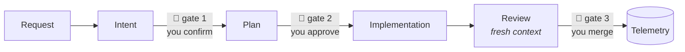

<div align="center">

# Contract Runtime

**A deterministic workflow engine for AI coding agents.**
**Your AI writes the code. Contract Pipeline governs the process — typed contracts, human approval gates, reproducible telemetry.**

[](tests/)
[](pyproject.toml)
[-lightgrey)](pyproject.toml)
[](docs/governance.md)

</div>

---

Consequential work moves through five contracted phases and pauses at three
points for your approval. Everyday work takes the **express lane** — one
stop, still reviewed and still verified — and which lane applies is computed
from the change, not argued by the agent. Either way it leaves a reproducible
evidence trail. Contract Runtime ships with a Claude Code runtime, so all of
it is conversational: `/task add`, `/work`, done.

AI coding agents are great at writing code and terrible at accountability.
They plan in their heads, drift from what you asked, review their own work,
and leave no record of any of it.

Contract Pipeline replaces vibes with **five typed contracts**. Each phase of
a task consumes one artifact and produces the next — hash-pinned, validated,
and reviewable — with up to **three human approval gates**: confirm the
intent, approve the plan, merge the result. Everything in between is
autonomous *within contract*, and everything that happens becomes one line of
telemetry that decides how the process itself evolves.

How much process a task gets is the one thing an agent may propose but never
decide. A **computed floor** — governed paths, diff extent, repo policy —
sets the minimum; you choose the lane at or above it; going below is possible,
but it is written down, reasoned, and counted. Nothing merges unreviewed and
nothing merges unverified, on any lane.



Every finished task becomes one reproducible line of evidence:

```json
{"outcome": "merged:f00dfeed", "plan_edited_at_gate": true,
 "escalations": [{"trigger_id": "E2"}], "undeclared_deviations_found": false}
```

That's the governance loop: the contracts are hypotheses about how
development should work, and telemetry is how they're tested. Contracts
that stop earning their keep get deleted.

The agent never decides its own status, never computes a hash, and never
reviews its own work — review runs in **fresh context** with read-only tools,
adjudicating the diff against the approved plan and the agent's own
**deviation ledger**. An empty ledger isn't an omission; it's a signed claim
the reviewer tests.

## Highlights

- 🧾 **Artifacts are the API.** Five markdown artifacts with schemas,
  required sections, and `sha256`-pinned upstream hashes. Edit anything
  upstream and everything downstream goes stale — transitively, automatically.
- 🚦 **Three approval gates, zero babysitting.** Approval is pinned to the
  exact bytes you approved; editing an approved plan reopens the gate.
  Between gates, `/work` runs the whole loop.
- 🛑 **Escalation is compliance, not failure.** Five triggers (invalidated
  assumption, unplanned dependency, repeated verification failure, scope
  blow-up, checkpoint) *halt* execution and route backward — by contract.
- 🔍 **Deterministic core, auditable everywhere.** Status is a pure function
  of files — no daemon, no database, byte-identical output for identical
  inputs. A shell script can drive the entire state machine (we test that).
- 📊 **Telemetry that governs.** Every merged task appends one reproducible
  JSON record answering the questions each contract pre-registered to
  justify its own existence — including which lane it ran and whether the
  floor was overridden — and [ten jq queries](docs/queries.md) run the trial.
- 🔌 **Agent-agnostic by construction.** The core is contracts + a deterministic CLI.
  Claude Code binding included; any runtime that can shell out can drive it.
  CI enforces that the product never references any runtime.

## Quick start

Requires Python ≥ 3.9 and git. Zero dependencies — nothing is
pip-installed and nothing lands on PATH; the deterministic core is
invoked by path, so it works identically inside Claude Code, Codex, CI,
or any shell (D30).

```console
$ git clone https://github.com/hashirventhodi/contract-runtime ~/Code/tools/contract-runtime
$ cd ~/Code/tools/contract-runtime && ./install.sh
$ python3 scripts/selftest.py     # prove determinism on this machine
```

In any repository, set it up once:

```console
$ python3 ~/.claude/pipeline/core/pipeline_cli.py init
```

The bundled **Claude Code runtime** is what provides the slash commands —
`/task`, `/work`, `/status` — as thin bindings over the deterministic
core. (Other agents can provide the same commands by implementing the
[normative loop](docs/state-machine.md); Claude Code is simply the first
runtime.) Then everything is conversational:

```text
/task add Add a request id header to every API response
/work T-2026-07-25-add-a-request-id-header
```

(`/task add` prints the task ID — use the one it gives you.)

`/work` runs contract to contract and stops only when it needs you: it
shows you the intent to confirm, the plan to approve, and reports when the
task is ready to merge. Check in anytime with `/status <task-id>`.

Full setup: **[docs/install.md](docs/install.md)** ·
Existing repos (10 min, fully reversible): **[docs/migration.md](docs/migration.md)**

## What a task looks like

<!-- demo.gif: recorded with `vhs demo.tape` (see assets/demo.tape) once
     you have a real /work run — do not fake this recording. Suggested
     shots: /task add -> /work -> gate 2 approval -> review verdict ->
     telemetry line. -->

`/work` pauses at gate 2 and shows you the plan:

> **Plan ready for approval** (gate 2 of 3) — objective, three steps each with
> a `verify:` line, risks, out of scope. *Approve, edit, or send it back?*

You read it for two minutes — the highest-leverage two minutes in the
workflow — tighten the out-of-scope section, and say **"approved."** The
orchestrator notices your edit and records it (`plan_edited_at_gate:
true`): gates that get edited are gates that are working.

Mid-implementation, the agent discovers it needs a dependency the plan
never named. It doesn't improvise — trigger **E2** fires, execution halts,
and `/work` stops to ask you where to route it. After you merge the PR, CI
appends one reproducible record to `telemetry.jsonl`:

```json
{
  "outcome": "merged:f00dfeed",
  "escalations": [{"trigger_id": "E2", "from_contract": "execution"}],
  "ledger_entries": {"count": 1, "by_status": {"within-autonomy": 1}},
  "plan_edited_at_gate": true,
  "undeclared_deviations_found": false
}
```

Under the slash commands sits a deterministic CLI — the API the runtime
drives, and the reason none of this depends on any particular agent. A
human can run every transition by hand with it (that's not a fallback;
it's the model-independence proof, enforced by an end-to-end test where a
shell script plays the agent). Runtime authors and advanced users: see the
**[CLI reference](docs/cli.md)**.

## Design principles

1. **Contracts are the constitution.** Phases are implementations; the five
   contract texts in [`contracts/`](contracts/) are the spec, and code is
   parity-tested against them.
2. **The runtime orchestrates, never decides.** All logic lives in the
   deterministic core; the agent binding is thin prompts over a CLI — and a
   CI test fails if the product ever references a runtime.
3. **Store decisions, derive status.** The only stored state is an
   append-only log of human decisions. Everything else is computed, which is
   why crashing and resuming is a non-event.
4. **Enforcement over instruction.** Hard rules (immutable requests,
   append-only telemetry, no manifest edits mid-implementation) are hooks
   and validators, not prompt suggestions.
5. **Stable, not immutable.** The architecture evolves deliberately —
   on written cases grounded in real usage, reproducible failures, or
   telemetry — never by taste alone. See [governance](docs/governance.md).

## Documentation

| Guide | What it covers |
|---|---|
| [Installation](docs/install.md) | Fresh-machine setup (four commands) |
| [Migration](docs/migration.md) | Adopt in an existing repo; byte-identical rollback |
| [State machine](docs/state-machine.md) | The 16 statuses, lanes, normative precedence, clearing rules |
| [Architecture](docs/architecture.md) | Modules, invariants, the product/runtime boundary |
| [CLI reference](docs/cli.md) | The deterministic API under the slash commands — for runtime authors, CI, and no-AI use |
| [The contracts](contracts/) | Canonical texts — Intent, Findings, Planning, Execution, Review |
| [Quarterly review](docs/queries.md) | The five queries that put the process itself on trial |
| [Implementation decisions](docs/implementation-decisions.md) | D10–D13, the honest record |

## Contributing

The core is deliberately small and frozen; the most valuable contributions
right now are **runtime bindings** (Cursor, OpenCode, Codex CLI — the
[orchestration loop is normative](docs/state-machine.md)) and **telemetry
from real usage**. See [CONTRIBUTING.md](CONTRIBUTING.md).

## License

TBD — tracked as the repository's first issue. Until a license is
chosen, all rights reserved.
