# Architecture

Moved from the original README; this is the module-level truth the README
links to instead of embedding.

## Product / runtime boundary (D9)

The product is `pipeline/` + `contracts/` + `tests/`. Everything under
`runtime/` is a consumer. Dependency direction is one-way — runtime files
reference contract texts and shell out to the CLI; nothing in the product
may reference a runtime. Enforced by `test_product_never_references_runtime`
and the M5 dependency audit (product imports are stdlib only, D30).

The product exports exactly two stable interfaces — both aimed at
runtime authors, not end users (the end-user surface is the runtime's
slash commands):

1. the deterministic core (`pipeline_cli.py`, invoked by path — D30)
   — see docs/cli.md
2. the canonical contract texts (`contracts/*.md`)

## The artifact chain (detailed)

```mermaid
flowchart LR
    R["request.md<br/><i>immutable</i>"] --> C1{{"Intent"}}
    C1 --> I["intent.md"]
    I -- "gate 1: intent_confirmed" --> C2{{"Findings"}}
    C2 --> F["findings.md"]
    F --> C3{{"Planning"}}
    C3 --> P["plan.md"]
    P -- "gate 2: plan_approved" --> C4{{"Execution"}}
    C4 --> L["diff + ledger.md"]
    L --> C5{{"Review<br/><i>fresh context</i>"}}
    C5 --> V["review.md"]
    V -- "gate 3: merge" --> T[("telemetry.jsonl")]
```

Every downstream artifact pins the sha256 of everything it consumed;
staleness propagates transitively.

## Modules

- `pipeline/schemas.py` — artifact/contract registry, closed enums,
  telemetry metric registry (data, not logic). `_check_registry()` enforces
  graph invariants at import time: one producer per artifact, no orphans,
  valid consume edges, exactly one root (request) and one terminal
  (review), full reachability, acyclicity.
- `pipeline/artifact.py` — parse/serialize/hash. Bodies round-trip
  byte-identically; hashing is over exact file bytes; fence-aware section
  splitting; typed all-or-nothing parse errors.
- `pipeline/validate.py` — the type system. 24 rules with stable IDs,
  exhaustive passing+failing fixture coverage (meta-tested), transitive
  staleness, purity (byte-snapshot tested).
  Entry point: `python -m pipeline.validate <task_dir>`.
- `pipeline/decisions.py` — append-only log of the only stored state:
  consents (hash-pinned), bypass, escalations, routing, merge. Strict
  append, tolerant read.
- `pipeline/frontier.py` — status as a pure deterministic function of
  (artifacts, decisions). See docs/state-machine.md for the normative
  status and precedence tables. The lane in force (from the latest
  `disposition`, defaulting to `full`) selects which artifacts the chain
  walk requires; it parameterises the walk rather than forking it.
- `pipeline/floor.py` — the minimum process a change deserves: a pure
  function of (runtime-supplied facts, repo policy), fail-safe in one
  direction only, so every unknown yields `full`. Knows nothing of git.
- `pipeline/telemetry.py` — pure projection of each contract's declared
  telemetry questions; idempotent on (task, outcome); records contain no
  wall-clock values and are golden-tested byte-for-byte.
- `pipeline/cli.py` — thin wrapper. Exit codes: 0 ok / 1 usage /
  2 invalid / 3 needs-human.
- `runtime/claude/` — the Claude Code binding: 5 contract skill shims,
  9 commands (`/pipeline-work` implements the normative orchestration loop), the
  read-only reviewer agent, 3 hooks, `settings.example.json`, `install.sh`.

## Invariants (all executable as tests)

- Hashing is over exact file bytes; parsing never mutates files.
- Contract texts and `schemas.py` cannot drift silently (parity snapshot).
- The happy fixture chain is the executable specification: every
  `consumes[]` hash is the real sha256 of the pinned file.
- Consent is hash-pinned (D3): editing a confirmed intent or approved plan
  voids the consent and reopens the gate.
- Staleness is transitive: editing intent.md stales findings and plan
  (direct pins) and ledger/review (through unchanged files).
- The frontier and the validator are pure and location-independent.
- The mock-agent end-to-end drives NEW -> AWAITING_MERGE -> DONE with a
  non-AI producer and exactly two consent commands.
- Nothing merges unverified: a passing check must cover the tree the review
  pinned, for every verifier that recorded against it (D19).
- An agent cannot lower its own oversight: the floor is a pure function of
  facts it does not author, and the lane is a recorded human decision whose
  overrides are counted (D18/D20).
- The express lane substitutes rather than waives — provenance stays total,
  and adjudication, disclosure and verification are lane-independent (D21).
- M5 acceptance runs install, migration, a full happy path through the
  executable only, and a rollback asserting a byte-identical tree.

## Testing strategy

Fixtures are generated (`scripts/regen_fixtures.py`), never hand-written,
so every pinned hash is real. 339 tests; `python3 -m pytest -q`; plus
`python3 scripts/selftest.py`, the stdlib-only fresh-clone acceptance (D30).
